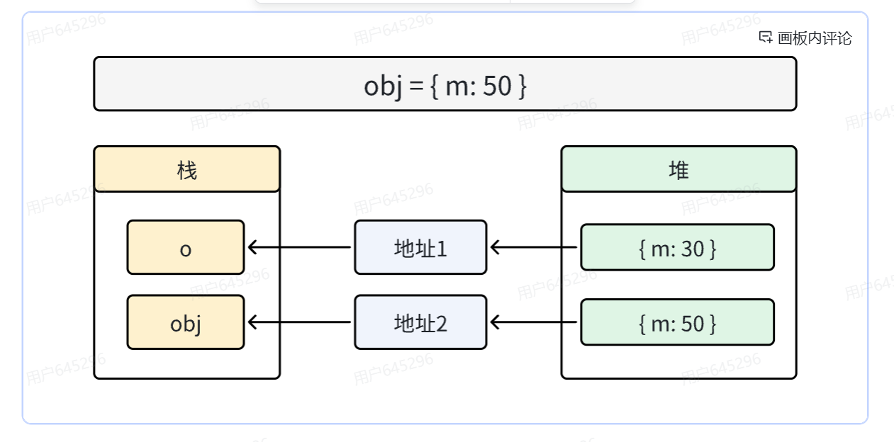

# JavaScript变量在内存中的堆栈存储

- 基础类型会存放与栈，引用类型会存放在堆
- 案例：以下代码为什么输出`50 30`

```javascript
function fn(obj) {
  obj = { m: 50 }
  console.log(obj.m)
}
const o = { m: 30 }
fn(o)
console.log(o.m)
```

## 解析

这段代码的关键在于理解**函数参数的按值传递（Call by Value）**以及**引用类型的存储方式**。

### 1. 初始状态

```javascript
const o = { m: 30 }
```

- **堆内存（Heap）**：创建了一个对象 `{ m: 30 }`，假设它的内存地址是 `0x001`。
- **栈内存（Stack）**：变量 `o` 存储了该对象的引用（即地址 `0x001`）。

### 2. 调用函数 `fn(o)`

```javascript
fn(o)
```

- 函数 `fn` 被调用，创建了一个新的执行上下文。
- **参数传递**：JS 中函数参数是**按值传递**的。
  - 这里传递的是变量 `o` 的值，也就是地址 `0x001`。
  - 所以，函数内部的局部变量 `obj` 初始时也指向地址 `0x001`。
  - 此时：`o` -> `0x001`, `obj` -> `0x001`。

### 3. 函数内部执行

```javascript
obj = { m: 50 }
```

- **堆内存**：创建了一个**新对象** `{ m: 50 }`，假设它的地址是 `0x002`。
- **赋值操作**：将这个新地址 `0x002` 赋值给局部变量 `obj`。
- **关键点**：这个赋值操作**切断**了 `obj` 与原对象 `0x001` 的联系。
  - 此时：`obj` -> `0x002`。
  - 外部变量 `o` 仍然指向 `0x001`，完全没有受到影响。

```javascript
console.log(obj.m)
```

- 输出 `obj` 指向的新对象（`0x002`）的 `m` 属性，即 **50**。

### 4. 函数执行结束

- 函数上下文销毁，局部变量 `obj` 释放。
- 外部代码继续执行。

```javascript
console.log(o.m)
```

- 访问外部变量 `o`。
- `o` 始终指向原对象（`0x001`），其内容 `{ m: 30 }` 从未被修改。
- 输出 **30**。

### 总结图示


